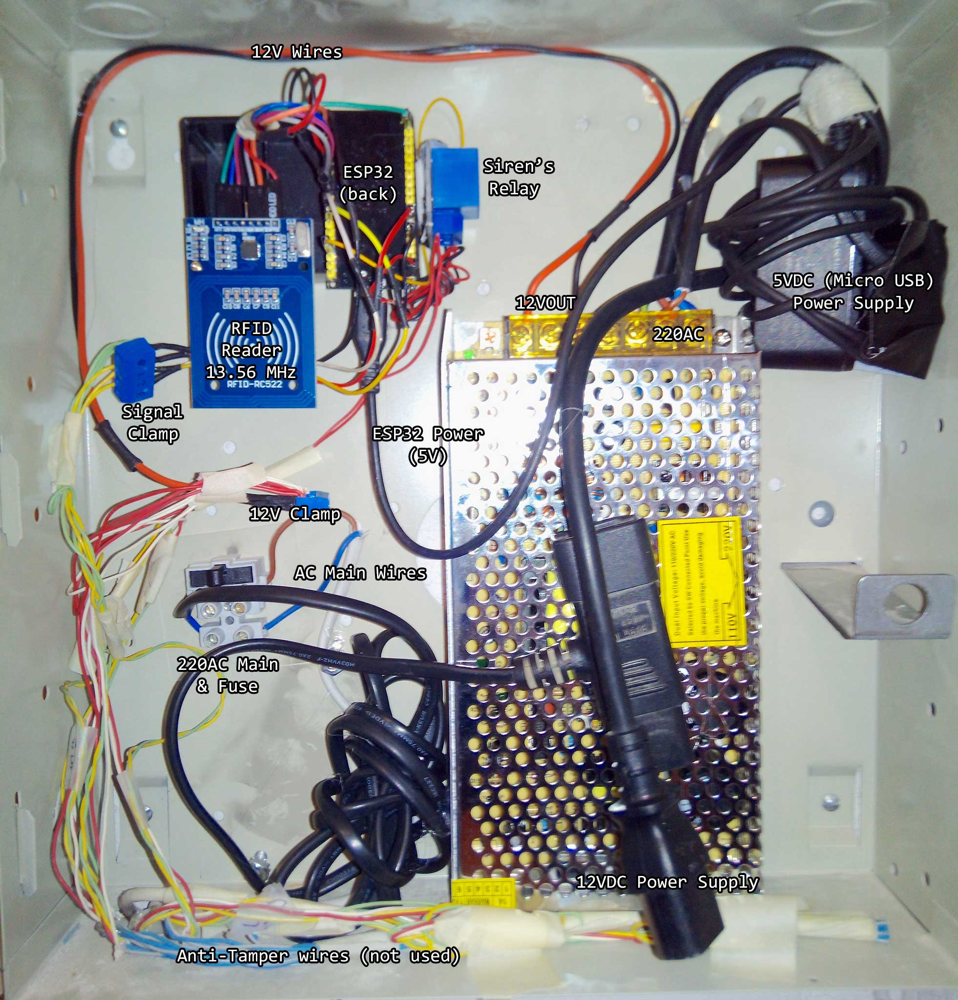
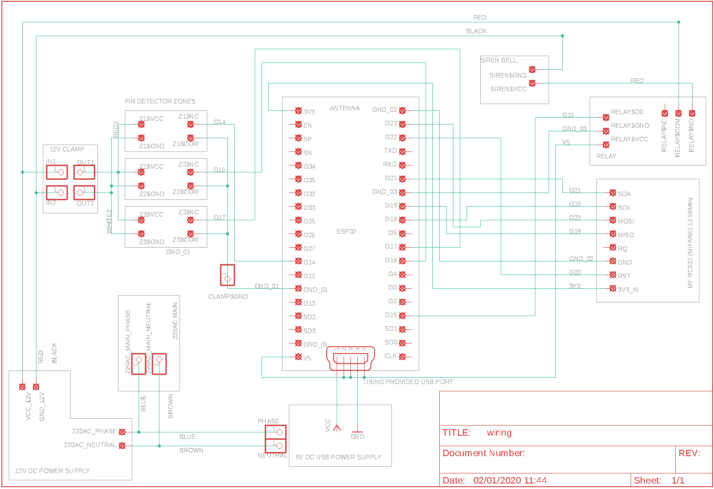
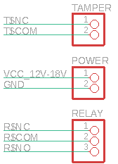
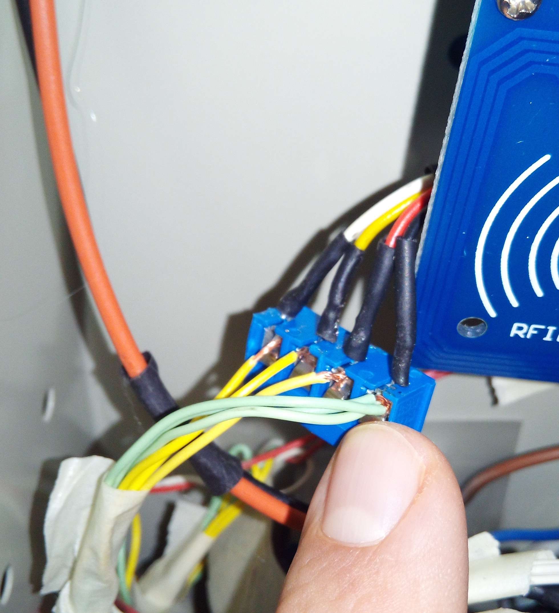
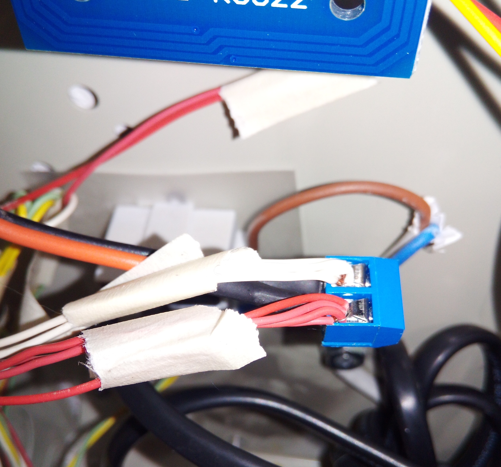
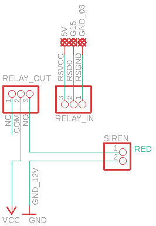
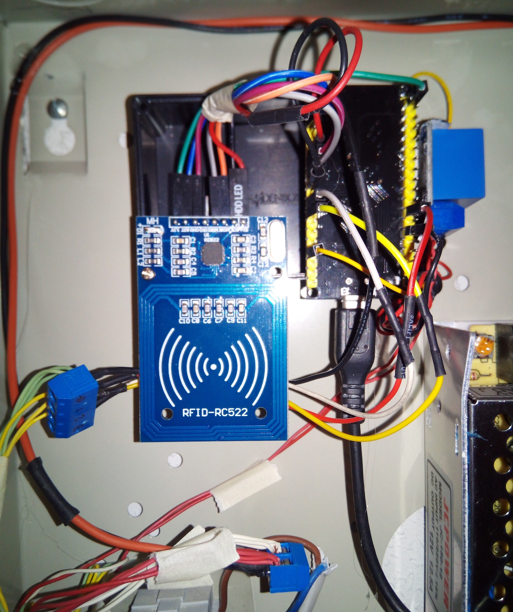
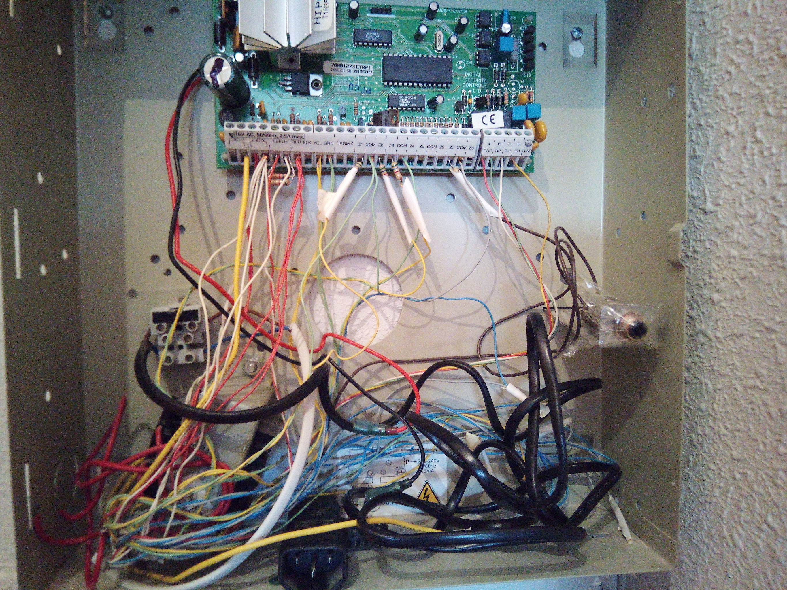

# Alarm
A simple, WiFi enabled alarm with RFID and WWW interface. If you don't want WWW support, it works with small
arduinos (e.g. NANO). If not, ESP32 is recommended. Also will work with ESP8266.

This project builds an alarm controller reusing the existing components:

* three motion detectors (pir and microwave)
* siren bell

This project provides:

1. The software to control the feeder.
2. The electronics schemas to connect all the parts.

</img>

# Table Of Contents

1. [Project Features](#project-features)
2. [Wiring Diagram](#wiring-diagram)
    1. [PIR Detector](#pir-detector)
    2. [Siren](#siren)
    3. [RFID RC522 Reader](#rfid-reader)
    4. [Power supply](#power-supply)

3. [Additional Notes](#additional-notes)

# Project Features

1. Provides support for existing PIR & MicroWave motion detectors
2. Provides support for existing alarm siren
3. Adds WiFi support (as AP or STA)
4. Support full config using a simple JSON File
5. Support Enable/Disable specific zones (covered by motion detectors)
6. Add RFID support for enable/disable the alarm
7. Add a WWW interface for basic control (with auth) and log file recording.
8. Managed using web interface. Alarm provides a WWW server that provides the following capabilities:
    * NTP client, so we manage the current time.
    * If started as AP, you can set the time using the client (web navigator) stamp instead, automatically.
    * Configuration persistence (SPIFFS).
    * Detailed log of Alarms's operation, so you can check what happen.
    * Modern HTML / JS interface, AJAX based operation.
9. Cheap to build. Based on standard hardware components:
    * ESP32 Core on an NodeMCU LoLin v3 development board (about 7€).
    * Simple 5v relay board (about 1€).
    * 12V DC power supply (about 20€).
    * 5V DC power supply (reused from a nokia mini-usb charger).
    * Some wiring cable.
    * Some clamps to join the existing cables.
10. Easy of operation:
    * Arm / Disarm the alarm using a RFID key or use the WWW interface.
    * Select what zones you want to ring using the config file or the WWW interface.
    * Integrate the alarm with your WiFi network, or use their own standalone AP.

# Wiring Diagram



## Pir Detector

Commercial PIR detectors are build on a PIR detector, and a microwave detector, in the same package. They are
configured to skip pets (less 5Kg) and you can fine-tune the detection with some resistors inside the box. They
feature an anti-tamper circuit (switches connected to the box) based on an NC (normally closed) circuit (the blue and light blue cables). These detectors are powered by a DC current about 9V->18V (I get mine working fine at 12V). The 
detector output is built on a single relay, NC (normally closed), NO (normally open). In these case, all my detectors are wired as NC (circuit is allways closed, but if something is found, then is open). This is importat becouse you need to configure your inputs based on this: ***NC: input PULLUP, NO: input PULLDOWN***.

Connections in the detector side:

</img>

| PIN       |WIRED_TO   | COLOR  | DESCRIPTION                       |
|-----------|-----------|--------|----------------------------------:|
|T$NC       | None      | Blue   | tamper output pin                 |
|T$COM      | None      | Purple | put all these together to GND_xx  |
|VCC        | VCC clamp | Red    | 12V-18V.                          |
|GND        | GND clamp | Wite   | put all these together to OUT2    |
|R$NC       | Zx pin    | Yellow | use the Gxx with INPUT_PULLUP     |
|R$COM      | GND pin   | Green  | put all these together to GND_01  |
|R$NO       | None      | None   | No connected                      |

I have three detectors, So I have three zones, requiring 3 input pins for each zone. I wired it to 14,16,17 GPIO
pins:

| ZONE      | PIN    |
|-----------|-------:|
| 1         | G14    |
| 2         | G16    |
| 3         | G17    |

Easily configured in the `config.json` file:

```json
 "zones": [ 
          { "pin": 14, "name": "main door", "enabled": true }, 
          { "pin": 16, "name": "hall",      "enabled": true }, 
          { "pin": 17, "name": "garage",    "enabled": true }
      ],
```

In the alarm side, we get three hoses for each detector. Each hose have three pairs of wires:

* Blue, Purple: Tamper wires. Not used.
* Red, White: Power wires. Red is VCC, white is GND.
* Yellow, Green: Signal wires. Yellow is the signal, Green is the GND.

Wiring:

* We wire all the *GREEN* cables together, to the `GND_01` CLAMP
* Wire each *YELLOW* wire to the `Gxx` input PIN (ESP32)

</img>


* We wire all the *WHITE* cables together, to the `OUT2` CLAMP (GND)
* We wire all the *RED* cables together, to the `OUT1` CLAMP (VCC)
* We wire the **SIREN's** white cable to the `OUT2` CLAMP (GND)

</img>

## Siren

Siren operates in a 12V, lots of amps. It's very noisy, and you only do two things: power it up, or power it down.
I put a relay between the microcontroller logic and the siren, So I can do some control without frying the microcontroller. I see that 12V works properly (and does lot of noise). With my configuration, only one pin (GP15) is
required to sound the siren bell. 



`Relay_IN` pin layout (interfacing the microcontroller)

| PIN       |WIRED_TO   | COLOR  | DESCRIPTION                          |
|-----------|-----------|--------|-------------------------------------:|
|R$D0       | G15 pin   | Yellow | The output pin to activate the relay |
|R$VCC      | 5V        | Red    | 5V                                   |
|R$GND      | GND_03    | Black  | GND                                  |

`Relay_OUT` pin layout (interfacing the siren)

| PIN       |WIRED_TO          | COLOR  | DESCRIPTION                       |
|-----------|------------------|--------|----------------------------------:|
|NO         | red wire (siren) | Red    | Connect to the siren bell (NC)    |
|COM        | red wire (12V)   | Red    | 12V VCC (to power the siren)      |
|NC         | None             | None   | Not used                          |

The siren's *white* wire is connected directly to `GND_12V` (black wire)

Easily configured in the `config.json` file:

```json
  "siren": {  "pin": 15, "duration": 60000}, 
```

## RFID Reader

</img>


## Power Supply


## Old Alarm System

DSC power832 5010

</img>
