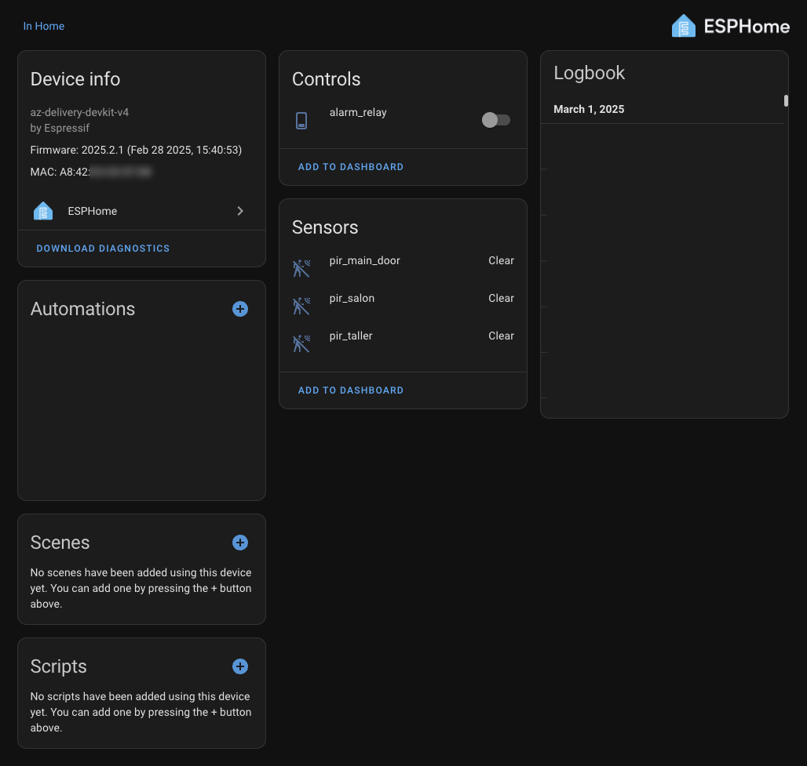
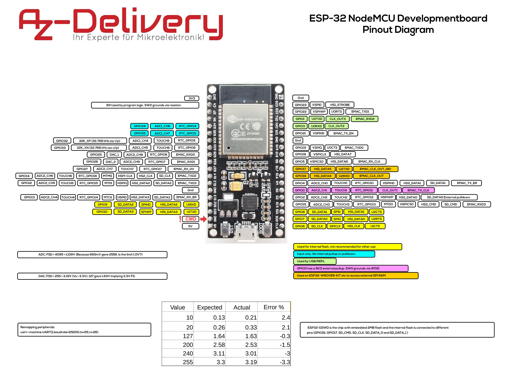
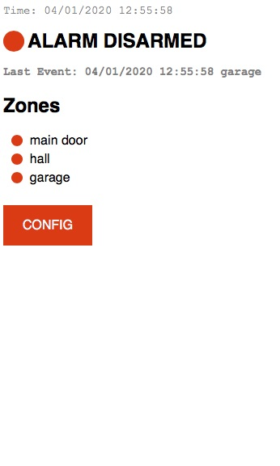
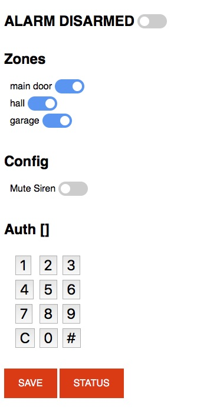
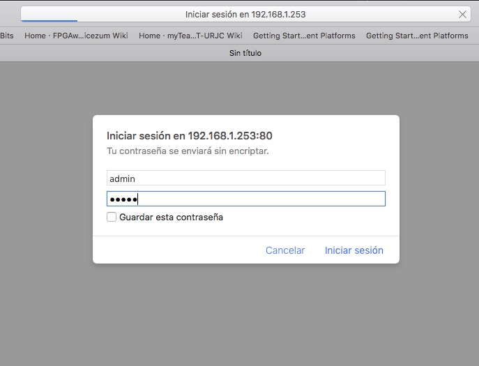
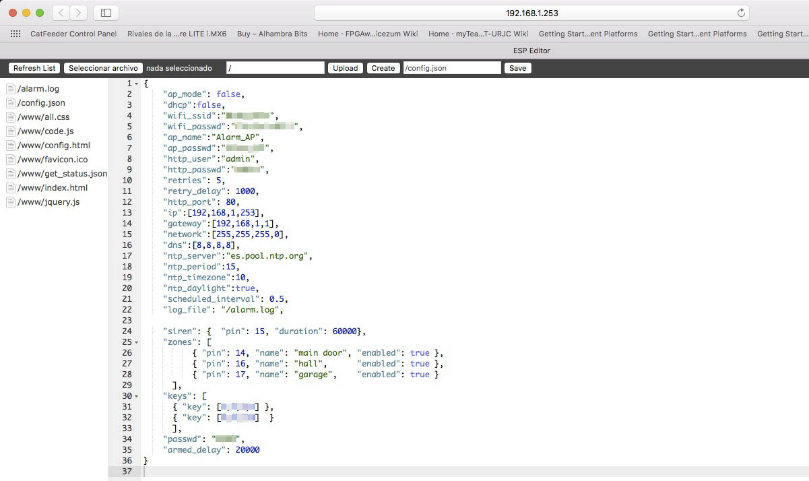

# Alarm

**IMPORTANT UPDATE 1/03/2025**

I have integrated the system into [ESPHome](https://esphome.io/) to allow integration of the device inside the
[Home Assistant](https://www.home-assistant.io/) platform. Is a One-to-One dropin, mantaining all the wiring, 
devices and functionality, but now is managed using HomeAssistant and it's automations (e.g. trigger the alarm)
on camera detection, and son on.

A simple, WiFi enabled alarm with RFID and WWW interface. If you don't want WWW support, it works with small
arduinos (e.g. NANO). If not, ESP32 is recommended. Also will work with ESP8266.

This project builds an alarm controller reusing the existing components:

* three motion detectors (pir and microwave)
* siren bell

This project provides:

1. The software to control the feeder.
2. The electronics schemas to connect all the parts.

</img>

# Table Of Contents

- [Alarm](#alarm)
- [Table Of Contents](#table-of-contents)
- [ESPHome](#esphome)
  - [A note about old Mac (high sierra) install](#a-note-about-old-mac-high-sierra-install)
  - [Installing the Alarm YAML](#installing-the-alarm-yaml)
- [Project Features](#project-features)
- [Wiring Diagram](#wiring-diagram)
  - [Pir Detector](#pir-detector)
  - [Siren](#siren)
  - [RFID Reader](#rfid-reader)
  - [Power Supply](#power-supply)
  - [Old Alarm System](#old-alarm-system)
- [How to install the Software](#how-to-install-the-software)
  - [Arduino Board Setup](#arduino-board-setup)
  - [Configuration options](#configuration-options)
  - [Configuration File](#configuration-file)
    - [Getting the RFID keys](#getting-the-rfid-keys)
  - [Download the components to the Board](#download-the-components-to-the-board)
    - [Check for good compilation](#check-for-good-compilation)
    - [Download the FileSystem to the board](#download-the-filesystem-to-the-board)
    - [Download the Alarm application to the board](#download-the-alarm-application-to-the-board)
- [How it Works](#how-it-works)
- [Web Interface](#web-interface)
  - [Check Status](#check-status)
  - [Config Zones](#config-zones)
  - [Change Configuration](#change-configuration)
  - [Alarm Log](#alarm-log)

# ESPHome

[ESPHome](https://esphome.io/) is a framework that allows the ESP32 family to be integrated on HomeAssisant integrations
by means of simple YAML configuration files, and OTA updates. The first time is too tricky to flash, but after that, the
system works flawless. The easiest way of install this is create a simple esphome project with the wizard, an flash it
locally using the USB. See [This Guide](https://esphome.io/guides/installing_esphome) for manual configure the ESPHOME
enviroment locally.

```
% pip3 install wheel
% pip3 install esphome
```

Now, create a simple test and configure it with your WIFI settings (e.g. SSID, Passwd). It's advisable map the MAC
address of the device on the DHCP server and make an address reservation for it (so the device has all the time the
same IP) it's not needed because it uses mDNS, but for inventory porpouses it's advisable. see [This Guide](https://esphome.io/guides/getting_started_command_line) to create the sample YAML file.

```
% esphome wizard livingroom.yaml 
```

The first time you need to have phisically connected to the ESP32 by USB cable. So upload the script (and the firmware). Set the USB port as needed.

```
% esphome run livingroom.yaml --device=/dev/ttyUSB0
```

That's all. You have the ESPHOme installed. Then, if it's the first time, deploy de **dashboard** on your server, so you 
can manage the ESPHOME devices remotely. `config` is the directory when you store all the ESPHOME configurations (a.k.a YAML files). The port for the dashboard is **`6052`**. Now let's deploy our ALARM script into the ESP32 Node

```
% pip install tornado esptool
% esphome dashboard config
```

## A note about old Mac (high sierra) install

On my old mac (high sierra) I have lot of problems with SSL certificates and python (obsolete certs). So I have to trick
it in order to work. I have this here for documentation. I Use `python3.10` on mac (I can't install anything modern here)
ESPHome is installed on `$HOME/Library/Python/3.10/bin/esphome --version`. To allow upgrading `platformio` using by 
ESPHOME to build the images, I have to do the following:

1. open visual estudio code with platform_io
2. open a project
3. run the > platformio cli from the toolbar palette
4. update with `pio run -d /Archive/Src/nvr/esp32/esphome/.esphome/build/eh_test`
5. done go again to esphome (command line in a shell, outside the VSCode)
6. `$HOME/Library/Python/3.10/bin/esphome  run eh_test.yaml --device=/dev/cu.SLAB_USBtoUART`
7. Now `platformio` is updated and can deploy the firmware by command line.

## Installing the Alarm YAML

Create a new project on ESPHOME dashboard called esp32_alarm.yaml the full code is here <a href="Software/esphome/esp32_alarm.yaml">esp32_alarm.yaml</a> First of all add the configuration block:

```yaml
esphome:
  name: esp32_alarm

esp32:
  board: az-delivery-devkit-v4
  framework:
    type: arduino

# Enable logging
logger:

# Enable Home Assistant API
api:
  password: ""

ota:
  - platform: esphome
    password: ""

wifi:
  ssid: "WLAN_AP24"
  password: "F1rulais66!!"

  # Enable fallback hotspot (captive portal) in case wifi connection fails
  ap:
    ssid: "Esp32 Alarm Fallback Hotspot"
    password: "ewfGwxUXOEaJ"

captive_portal:
```

The most important fields are `board` (use `ESP32/az-delivery-devkit-v4` in my case) and `wifi` fields. Set the `ssid` and
`password` files right. Leave the `ota` `password` field empty. Now, configure the sensors. See below for wiring and operation:

```yaml
binary_sensor:

  - platform: gpio
    name: "pir_main_door"
    device_class: motion
    pin: 
      number: GPIO14
      mode:
        pullup: true
        input: true
    filters:
      - delayed_off: 100ms
    
  - platform: gpio
    name: "pir_salon"
    device_class: motion
    pin: 
      number: GPIO16
      mode:
        pullup: true
        input: true
    filters:
      - delayed_off: 100ms

  - platform: gpio
    name: "pir_taller"
    device_class: motion     
    pin: 
      number: GPIO17
      mode:
        pullup: true
        input: true
    filters:
      - delayed_off: 100ms

switch:
  - platform: gpio
    pin: GPIO15
    inverted: false
    name: "alarm_relay"
```

The `binary_sensor` sections maps the PIR detectors. Note the `pullup` and `delayed_off` fields. The `switch` section maps the alarm (siren) relay. As easy as this. Then go to the homeassistant instance, and you will find, under devices the new
detected device, with all the sensors (pir sensors) and the relay (alarm_relay). Now is time to start doing automations.




# Project Features

1. Provides support for existing PIR & MicroWave motion detectors
2. Provides support for existing alarm siren
3. Adds WiFi support (as AP or STA)
4. Support full config using a simple JSON File
5. Support Enable/Disable specific zones (covered by motion detectors)
6. Add RFID support for enable/disable the alarm
7. Add a WWW interface for basic control (with auth) and log file recording.
8. Managed using web interface. Alarm provides a WWW server that provides the following capabilities:
    * NTP client, so we manage the current time.
    * If started as AP, you can set the time using the client (web navigator) stamp instead, automatically.
    * Configuration persistence (SPIFFS).
    * Detailed log of Alarms's operation, so you can check what happen.
    * Modern HTML / JS interface, AJAX based operation.
9. Cheap to build. Based on standard hardware components:
    * ESP32 Core on an NodeMCU LoLin v3 development board (about 7€).
    * Simple 5v relay board (about 1€).
    * 12V DC power supply (about 20€).
    * 5V DC power supply (reused from a nokia mini-usb charger).
    * Some wiring cable.
    * Some clamps to join the existing cables.
10. Easy of operation:
    * Arm / Disarm the alarm using a RFID key or use the WWW interface.
    * Select what zones you want to ring using the config file or the WWW interface.
    * Integrate the alarm with your WiFi network, or use their own standalone AP.

# Wiring Diagram

This is the general main wiring diagram. **Note the ESP32 pin out (Az-Delivery, NodeMCU ESP-32)**

</img>

## Pir Detector

Commercial PIR detectors are build on a PIR detector, and a microwave detector, in the same package. They are
configured to skip pets (less 5Kg) and you can fine-tune the detection with some resistors inside the box. They
feature an anti-tamper circuit (switches connected to the box) based on an NC (normally closed) circuit (the blue and light blue cables). These detectors are powered by a DC current about 9V->18V (I get mine working fine at 12V). The 
detector output is built on a single relay, NC (normally closed), NO (normally open). In these case, all my detectors are wired as NC (circuit is allways closed, but if something is found, then is open). This is importat becouse you need to configure your inputs based on this: ***NC: input PULLUP, NO: input PULLDOWN***.

Connections in the detector side:

</img>

| PIN       |WIRED_TO   | COLOR  | DESCRIPTION                       |
|-----------|-----------|--------|----------------------------------:|
|T$NC       | None      | Blue   | tamper output pin                 |
|T$COM      | None      | Purple | put all these together to GND_xx  |
|VCC        | VCC clamp | Red    | 12V-18V.                          |
|GND        | GND clamp | Wite   | put all these together to OUT2    |
|R$NC       | Zx pin    | Yellow | use the Gxx with INPUT_PULLUP     |
|R$COM      | GND pin   | Green  | put all these together to GND_01  |
|R$NO       | None      | None   | No connected                      |

I have three detectors, So I have three zones, requiring 3 input pins for each zone. I wired it to 14,16,17 GPIO
pins:

| ZONE      | PIN    |
|-----------|-------:|
| 1         | G14    |
| 2         | G16    |
| 3         | G17    |

Easily configured in the `Software/data/config.json` file:

```json
 "zones": [ 
          { "pin": 14, "name": "main door", "enabled": true }, 
          { "pin": 16, "name": "hall",      "enabled": true }, 
          { "pin": 17, "name": "garage",    "enabled": true }
      ],
```

In the alarm side, we get three hoses for each detector. Each hose have three pairs of wires:

* Blue, Purple: Tamper wires. Not used.
* Red, White: Power wires. Red is VCC, white is GND.
* Yellow, Green: Signal wires. Yellow is the signal, Green is the GND.

Wiring:

* We wire all the *GREEN* cables together, to the `GND_01` CLAMP
* Wire each *YELLOW* wire to the `Gxx` input PIN (ESP32)

</img>


* We wire all the *WHITE* cables together, to the `OUT2` CLAMP (GND)
* We wire all the *RED* cables together, to the `OUT1` CLAMP (VCC)
* We wire the **SIREN's** white cable to the `OUT2` CLAMP (GND)

</img>

## Siren

Siren operates in a 12V, lots of amps. It's very noisy, and you only do two things: power it up, or power it down.
I put a relay between the microcontroller logic and the siren, So I can do some control without frying the microcontroller. I see that 12V works properly (and does lot of noise). With my configuration, only one pin (GP15) is
required to sound the siren bell. 


`Relay_IN` pin layout (interfacing the microcontroller)

| PIN       |WIRED_TO   | COLOR  | DESCRIPTION                          |
|-----------|-----------|--------|-------------------------------------:|
|R$D0       | G15 pin   | Yellow | The output pin to activate the relay |
|R$VCC      | 5V        | Red    | 5V                                   |
|R$GND      | GND_03    | Black  | GND                                  |

`Relay_OUT` pin layout (interfacing the siren)

| PIN       |WIRED_TO          | COLOR  | DESCRIPTION                       |
|-----------|------------------|--------|----------------------------------:|
|NO         | red wire (siren) | Red    | Connect to the siren bell (NC)    |
|COM        | red wire (12V)   | Red    | 12V VCC (to power the siren)      |
|NC         | None             | None   | Not used                          |

The siren's *white* wire is connected directly to `GND_12V` (black wire)

Easily configured in the `Software/data/config.json` file:

```json
  "siren": {  "pin": 15, "duration": 60000}, 
```

## RFID Reader

</img>


## Power Supply

## Old Alarm System

DSC power832 5010

</img>


# How to install the Software


Alarm uses [ESPAsyncWebServer](https://github.com/me-no-dev/ESPAsyncWebServer) as webserver implementation. Keep in mind that you can't use `delay()` function becouse it breaks the "async". You need the following libraries installed in your Arduino `libraries` folder.

    * [ArduinoJson-6.x](https://github.com/bblanchon/ArduinoJson) (the 6.x branch)
    * [ESPAsyncTCP](https://github.com/me-no-dev/ESPAsyncTCP)
    * [ESPAsyncWebServer](https://github.com/me-no-dev/ESPAsyncWebServer)
    * [NtpClient](https://github.com/arduino-libraries/NTPClient)
    * [Time](https://github.com/PaulStoffregen/Time)
    * [Mifare522 MFRC522](https://github.com/miguelbalboa/rfid)


Then, get the [Alarm Repo](https://github.com/juanmcasillas/alarm) and compile it using the Arduino IDE.

## Arduino Board Setup

I use a *Az-Delivery, NodeMCU ESP-32* board. There are many different development boards using ESP-32, you should use whatever implementation you want, but you have to adapt the pinout and how to configure the board for the Arduino IDE in order to compile and download the application.

</img>

You need some things in Arduino IDE in order to work:

* First install the serial driver, if not installed before, for your platform [CP210x Driver](https://www.silabs.com/products/development-tools/software/usb-to-uart-bridge-vcp-drivers)
Then add ESP8266 aditional library:
* Go to `Preferences`, add in `Additional Board Manager URLs` the following URL: [https://dl.espressif.com/dl/package_esp32_index.json](https://dl.espressif.com/dl/package_esp32_index.json)
* Restart The Arduino IDE.
* Go to `Tools->Board->Board Manager` and search `ESP32 by Expressif Systems` library and install it (I use version `1.0.2`)
* Install the ESP32FS Flash filesystem tools form Arduino. Uncompress [package](https://github.com/me-no-dev/arduino-esp32fs-plugin/releases/download/1.0/ESP32FS-1.0.zip) inside `C:\Software\Arduino\tools`
* Install Exception Decoder ESP. Not really needed to install the software, but can help you to troubleshoot some things if fail. Uncompress [package](https://github.com/me-no-dev/EspExceptionDecoder/releases/download/1.1.0/EspExceptionDecoder-1.1.0.zip) inside `C:\Software\Arduino\tools`
* Restart the Arduino IDE.

Now, You have to configure the Board options:

* Board: `NodeMCU 32-S`
* Upload Speed: `921600` (If you can't connect at this speed, check the cable or select a lower speed)
* CPU Freq: `80 MHz`
* Flash Size: `4M (2M SPIFFS)`. This is importart. If you don't do select that, you can't flash the FileSystem.
* Debug port: `Disabled`
* Debug Level: `None`
* IWIP Variant: `v2 Lower Memory`
* VTables: `Flash`
* Exceptions: `Disabled`
* Erase Flash: `Only Sketch`
* Port: Your USB port.
* Programmer: `AVRISP mkII`

Try to upload any arduino example to check the toolchain.

## Configuration options

Alarm is configured in the `/Software/data/config.json` file. But you have to change definitions, if you change the pinout (e.g. the RC522 wires, or whatever). Let's see:

`Software/alarm/alarm.ino`:

```c++
#define SERIAL_BAUD_RATE 115200             // Serial port debug max speed
#define CONFIG_FILE "/config.json"          // where the config file is stored in the SPIFFS partition
#define CALLBACK_PREFIX "/alarm"            // prefix for webservices callback

```

`Software/alarm/config.h`

Main configuration file. You should only change the `BEEP*` configuration files. `MAX_TIME_DRIFT` is used when setting the timestamp from the browser. Let me explain this. When the ESP32 is started as AP, there's no internal RTC inside, so the timestamp starts in the EPOCH. (1970). When the browser connects to the web server and download the `index.html` file, some javascript is executed, and the local timestamp is passed when asking for the status ajax resource. The server checks the `MAX_TIME_DRIFT` and if the result is greater, the ESP timestamp is updated, so it reflects the current date (UTC for now, sorry)

```c++
#define MAX_ZONES 5     // maximum monitored zones (check pins availability)
#define MAX_KEYS  5     // maximum RFID valid keys numbers
#define KEY_SIZE  4     // RFID key size (4 bytes)
#define MAX_TIME_DRIFT 3600  // max time drift in seconds when trying to setting the time as AP (no NTP, no RTC)
#define BEEP_DURATION 50     // ms duration of the beep (alarm on)
#define BEEP_WAIT 1000       // ms wait before beeps
```

The class `ConfigClass` store de default values that can be read for the `Software/data/config.json`. The initial values are *hardcored* so if you want to change anything this is your side. Note that all this default values are rewritten with the data read from the `Software/data/config.json`.

```c++
class ConfigClass {
    public:
        bool ap_mode = false; // false, station (default)
        bool dhcp = false; 
        String wifi_ssid = "XXXX";
        String wifi_passwd = "YYYY";
        String ap_name = "alarm_AP";
        String ap_passwd = "alarm_AP";
        String http_user = "admin";
        String http_passwd = "admin";
        int retries = 5;
        int retry_delay = 5000; // 5 seconds
        int http_port = 80;
        IPAddress ip = IPAddress(192,168,5,100);
        IPAddress gateway = IPAddress(192,168,5,1);
        IPAddress network = IPAddress(255,255,255,0);
        IPAddress dns = IPAddress(8,8,8,8);
        String ntp_server = "es.pool.ntp.org";
        int ntp_period = 15;
        int ntp_interval = 63;
        int ntp_timezone = 10; // madrid/spain
        bool ntp_daylight = true;
        float scheduled_interval = 1.0;
        String log_file = "/logfile.log";

        //
        // alarm configuration
        //

        SirenClass siren;
        ZoneClass zones[MAX_ZONES];
        byte keys[MAX_KEYS][KEY_SIZE] = { 
            { 0, 0, 0, 0 },
            { 0, 0, 0, 0 },
            { 0, 0, 0, 0 },
            { 0, 0, 0, 0 },
            { 0, 0, 0, 0 },
        };

        String passwd = "1234";
        unsigned long armed_delay = 1000; // 1 second
        unsigned long armed_delay_time_left = 0;

        bool LoadConfig();
        bool SaveConfig();
        void begin(fs::FS *fs, String config_file);

        // non persistent config
        ALARM_STATUS STATUS = ALARM_STATUS::DISARMED; 
        bool armed = false;
        String last_event = "-";
        bool wifi_sta = true; // false if ESP32 started as AP
};
```

`Software/alarm/rfid.h`:

The pinout for the `SPI` pinout. Note the different development boards require different `SPI` pins. 

```c++
#define RST_PIN  22      //RST     - required for mfrc522 config
#define SDA_PIN  21      //SDA(SS) - required for mfrc522 config

#define SCK_PIN  18      //SCK  - harcoded in lib, not use them
#define MOSI_PIN 23      //MOSI - harcoded in lib, not use them
#define MISO_PIN 19      //MISO - harcoded in lib, not use them
```

## Configuration File

All the major options are set in the `Sofware/data/config.json` file, stored on the SPIFFS partition. I recommend
clone the repo, edit the file and then upload the partition (see below)

You should change:

* `wifi_ssid, wifi_ssid`: the STA (client) information for your wifi network.
* `ap_passwd`: the access point password where started in AP mode.
* `http_user, http_passwd`: the data to use the *edit spiffs* built in editor, to upload files (e.g. `config.json`)
* `ip, gateway, network`: to reflect your network settings
* `keys`: the RFID key values that allow valid arming (see below). Stored in *decimal*
* `password`: the password used to arm/disarm the alarm from the web interface.
* `armed_delay`: the time between the alarm is disarmed and become armed (to allow you to exit).

```json
{
    "ap_mode": false,
    "dhcp":false,
    "wifi_ssid":"XXXXX",
    "wifi_passwd":"YYYY",
    "ap_name":"Alarm_AP",
    "ap_passwd":"Alarm_AP",
    "http_user":"admin",
    "http_passwd":"admin",
    "retries": 5,
    "retry_delay": 1000,
    "http_port": 80,
    "ip":[192,168,1,253],
    "gateway":[192,168,1,1],
    "network":[255,255,255,0],
    "dns":[8,8,8,8],
    "ntp_server":"es.pool.ntp.org",
    "ntp_period":15,
    "ntp_timezone":10,
    "ntp_daylight":true,
    "scheduled_interval": 0.5,
    "log_file": "/alarm.log",

    "siren": {  "pin": 15, "duration": 60000},     
    "zones": [ 
          { "pin": 14, "name": "main door", "enabled": true }, 
          { "pin": 16, "name": "hall",      "enabled": true }, 
          { "pin": 17, "name": "garage",    "enabled": true }
      ],
    "keys": [      
      { "key": [1,2,3,4] },
      { "key": [5,6,7,8]  }
      ],
    "passwd": "6666",
    "armed_delay": 20000
}
```

### Getting the RFID keys

You have to get the valid key id in order to store them in the configuration file you the key is being recognized by the alarm as valid and allow you to arm/disarm the system. To do that, first of all upload `dev/rfid/rfid.ino` to the board, and check the serial monitor. When you pass the key near the reader, a key will be printed on the log:

```
Card UID: 123 223 231 12
```

Get these numbers, and save in the `Sofware/data/config.json` file:

```json
    "keys": [      
      { "key": [123,223,231,12] }
      ],
```

Yo can add up to `MAX_KEYS` keys (see `Software/config.h`). For example, adding another one:

```json
    "keys": [      
      { "key": [123,223,231,12] },
      { "key": [55 ,12 ,128,43] }
      ],
```


## Download the components to the Board

### Check for good compilation

 First of all, open `alarm.ino` file in *Arduino IDE* and issue a `Verify` to check that everything compiles (libraries, and so on). When you have a valid compilation, then you should have a log output like this:

 ```
Linking everything together...
/Users/assman/Library/Arduino15/packages/esp32/tools/xtensa-esp32-elf-gcc/1.22.0-80-g6c4433a-5.2.0/bin/xtensa-esp32-elf-gcc -nostdlib -L/Users/assman/Library/Arduino15/packages/esp32/hardware/esp32/1.0.2/tools/sdk/lib -L/Users/assman/Library/Arduino15/packages/esp32/hardware/esp32/1.0.2/tools/sdk/ld -T esp32_out.ld -T esp32.common.ld -T esp32.rom.ld -T esp32.peripherals.ld -T esp32.rom.spiram_incompatible_fns.ld -u ld_include_panic_highint_hdl -u call_user_start_cpu0 -Wl,--gc-sections -Wl,-static -Wl,--undefined=uxTopUsedPriority -u __cxa_guard_dummy -u __cxx_fatal_exception -Wl,--start-group /var/folders/cc/0xwh_8tn7xdf8834vtcvvlt00000gn/T/arduino_build_296729/sketch/alarm.cpp.o /var/folders/cc/0xwh_8tn7xdf8834vtcvvlt00000gn/T/arduino_build_296729/sketch/alarm.ino.cpp.o /var/folders/cc/0xwh_8tn7xdf8834vtcvvlt00000gn/T/arduino_build_296729/sketch/config.cpp.o /var/folders/cc/0xwh_8tn7xdf8834vtcvvlt00000gn/T/arduino_build_296729/sketch/helper.cpp.o /var/folders/cc/0xwh_8tn7xdf8834vtcvvlt00000gn/T/arduino_build_296729/sketch/logger.cpp.o /var/folders/cc/0xwh_8tn7xdf8834vtcvvlt00000gn/T/arduino_build_296729/sketch/rfid.cpp.o /var/folders/cc/0xwh_8tn7xdf8834vtcvvlt00000gn/T/arduino_build_296729/sketch/webserver.cpp.o /var/folders/cc/0xwh_8tn7xdf8834vtcvvlt00000gn/T/arduino_build_296729/libraries/FS/FS.cpp.o /var/folders/cc/0xwh_8tn7xdf8834vtcvvlt00000gn/T/arduino_build_296729/libraries/FS/vfs_api.cpp.o /var/folders/cc/0xwh_8tn7xdf8834vtcvvlt00000gn/T/arduino_build_296729/libraries/SPIFFS/SPIFFS.cpp.o /var/folders/cc/0xwh_8tn7xdf8834vtcvvlt00000gn/T/arduino_build_296729/libraries/ArduinoOTA/ArduinoOTA.cpp.o /var/folders/cc/0xwh_8tn7xdf8834vtcvvlt00000gn/T/arduino_build_296729/libraries/WiFi/ETH.cpp.o /var/folders/cc/0xwh_8tn7xdf8834vtcvvlt00000gn/T/arduino_build_296729/libraries/WiFi/WiFi.cpp.o /var/folders/cc/0xwh_8tn7xdf8834vtcvvlt00000gn/T/arduino_build_296729/libraries/WiFi/WiFiAP.cpp.o /var/folders/cc/0xwh_8tn7xdf8834vtcvvlt00000gn/T/arduino_build_296729/libraries/WiFi/WiFiClient.cpp.o /var/folders/cc/0xwh_8tn7xdf8834vtcvvlt00000gn/T/arduino_build_296729/libraries/WiFi/WiFiGeneric.cpp.o /var/folders/cc/0xwh_8tn7xdf8834vtcvvlt00000gn/T/arduino_build_296729/libraries/WiFi/WiFiMulti.cpp.o /var/folders/cc/0xwh_8tn7xdf8834vtcvvlt00000gn/T/arduino_build_296729/libraries/WiFi/WiFiSTA.cpp.o /var/folders/cc/0xwh_8tn7xdf8834vtcvvlt00000gn/T/arduino_build_296729/libraries/WiFi/WiFiScan.cpp.o /var/folders/cc/0xwh_8tn7xdf8834vtcvvlt00000gn/T/arduino_build_296729/libraries/WiFi/WiFiServer.cpp.o /var/folders/cc/0xwh_8tn7xdf8834vtcvvlt00000gn/T/arduino_build_296729/libraries/WiFi/WiFiUdp.cpp.o /var/folders/cc/0xwh_8tn7xdf8834vtcvvlt00000gn/T/arduino_build_296729/libraries/Update/Updater.cpp.o /var/folders/cc/0xwh_8tn7xdf8834vtcvvlt00000gn/T/arduino_build_296729/libraries/ESPmDNS/ESPmDNS.cpp.o /var/folders/cc/0xwh_8tn7xdf8834vtcvvlt00000gn/T/arduino_build_296729/libraries/AsyncTCP/AsyncTCP.cpp.o /var/folders/cc/0xwh_8tn7xdf8834vtcvvlt00000gn/T/arduino_build_296729/libraries/ESPAsyncWebServer/AsyncEventSource.cpp.o /var/folders/cc/0xwh_8tn7xdf8834vtcvvlt00000gn/T/arduino_build_296729/libraries/ESPAsyncWebServer/AsyncWebSocket.cpp.o /var/folders/cc/0xwh_8tn7xdf8834vtcvvlt00000gn/T/arduino_build_296729/libraries/ESPAsyncWebServer/SPIFFSEditor.cpp.o /var/folders/cc/0xwh_8tn7xdf8834vtcvvlt00000gn/T/arduino_build_296729/libraries/ESPAsyncWebServer/WebAuthentication.cpp.o /var/folders/cc/0xwh_8tn7xdf8834vtcvvlt00000gn/T/arduino_build_296729/libraries/ESPAsyncWebServer/WebHandlers.cpp.o /var/folders/cc/0xwh_8tn7xdf8834vtcvvlt00000gn/T/arduino_build_296729/libraries/ESPAsyncWebServer/WebRequest.cpp.o /var/folders/cc/0xwh_8tn7xdf8834vtcvvlt00000gn/T/arduino_build_296729/libraries/ESPAsyncWebServer/WebResponses.cpp.o /var/folders/cc/0xwh_8tn7xdf8834vtcvvlt00000gn/T/arduino_build_296729/libraries/ESPAsyncWebServer/WebServer.cpp.o /var/folders/cc/0xwh_8tn7xdf8834vtcvvlt00000gn/T/arduino_build_296729/libraries/Ticker/Ticker.cpp.o /var/folders/cc/0xwh_8tn7xdf8834vtcvvlt00000gn/T/arduino_build_296729/libraries/SPI/SPI.cpp.o /var/folders/cc/0xwh_8tn7xdf8834vtcvvlt00000gn/T/arduino_build_296729/libraries/MFRC522/MFRC522.cpp.o /var/folders/cc/0xwh_8tn7xdf8834vtcvvlt00000gn/T/arduino_build_296729/libraries/MFRC522/MFRC522Extended.cpp.o /var/folders/cc/0xwh_8tn7xdf8834vtcvvlt00000gn/T/arduino_build_296729/libraries/Time/DateStrings.cpp.o /var/folders/cc/0xwh_8tn7xdf8834vtcvvlt00000gn/T/arduino_build_296729/libraries/Time/Time.cpp.o /var/folders/cc/0xwh_8tn7xdf8834vtcvvlt00000gn/T/arduino_build_296729/libraries/NtpClient/NTPClientLib.cpp.o /var/folders/cc/0xwh_8tn7xdf8834vtcvvlt00000gn/T/arduino_build_296729/core/core.a -lgcc -lopenssl -lbtdm_app -lfatfs -lwps -lcoexist -lwear_levelling -lesp_http_client -lprotobuf-c -lhal -lnewlib -ldriver -lbootloader_support -lpp -lfreemodbus -lmesh -lsmartconfig -ljsmn -lwpa -lethernet -lphy -lfrmn -lapp_trace -lfr_coefficients -lconsole -lulp -lwpa_supplicant -lfreertos -lbt -lmicro-ecc -lesp32-camera -lcxx -lxtensa-debug-module -ltcp_transport -lmdns -lvfs -lmtmn -lesp_ringbuf -lsoc -lcore -lfb_gfx -lsdmmc -llibsodium -lcoap -ltcpip_adapter -lprotocomm -lesp_event -limage_util -lc_nano -lesp-tls -lasio -lrtc -lspi_flash -lwpa2 -lwifi_provisioning -lesp32 -lface_recognition -lapp_update -lnghttp -lspiffs -lface_detection -lespnow -lnvs_flash -lesp_adc_cal -llog -ldl_lib -lsmartconfig_ack -lexpat -lfd_coefficients -lm -lmqtt -lc -lheap -lmbedtls -llwip -lnet80211 -lesp_http_server -lpthread -ljson -lesp_https_ota -lstdc++ -Wl,--end-group -Wl,-EL -o /var/folders/cc/0xwh_8tn7xdf8834vtcvvlt00000gn/T/arduino_build_296729/alarm.ino.elf
python /Users/assman/Library/Arduino15/packages/esp32/hardware/esp32/1.0.2/tools/gen_esp32part.py -q /Users/assman/Library/Arduino15/packages/esp32/hardware/esp32/1.0.2/tools/partitions/default.csv /var/folders/cc/0xwh_8tn7xdf8834vtcvvlt00000gn/T/arduino_build_296729/alarm.ino.partitions.bin
/Users/assman/Library/Arduino15/packages/esp32/tools/esptool_py/2.6.1/esptool --chip esp32 elf2image --flash_mode dio --flash_freq 80m --flash_size 4MB -o /var/folders/cc/0xwh_8tn7xdf8834vtcvvlt00000gn/T/arduino_build_296729/alarm.ino.bin /var/folders/cc/0xwh_8tn7xdf8834vtcvvlt00000gn/T/arduino_build_296729/alarm.ino.elf
esptool.py v2.6
Multiple libraries were found for "WiFi.h"
 Used: /Users/assman/Library/Arduino15/packages/esp32/hardware/esp32/1.0.2/libraries/WiFi
 Not used: /Applications/Arduino.app/Contents/Java/libraries/WiFi
Multiple libraries were found for "AsyncTCP.h"
 Used: /Archive/Src/Arduino/libraries/AsyncTCP
Multiple libraries were found for "Ticker.h"
 Used: /Users/assman/Library/Arduino15/packages/esp32/hardware/esp32/1.0.2/libraries/Ticker
Multiple libraries were found for "SPIFFS.h"
 Used: /Users/assman/Library/Arduino15/packages/esp32/hardware/esp32/1.0.2/libraries/SPIFFS
Multiple libraries were found for "ArduinoOTA.h"
 Used: /Users/assman/Library/Arduino15/packages/esp32/hardware/esp32/1.0.2/libraries/ArduinoOTA
Multiple libraries were found for "ESPAsyncWebServer.h"
 Used: /Archive/Src/Arduino/libraries/ESPAsyncWebServer
 Not used: /Archive/Src/Arduino/libraries/ESPAsyncWebServer_old
Multiple libraries were found for "SPI.h"
 Used: /Users/assman/Library/Arduino15/packages/esp32/hardware/esp32/1.0.2/libraries/SPI
Multiple libraries were found for "Update.h"
 Used: /Users/assman/Library/Arduino15/packages/esp32/hardware/esp32/1.0.2/libraries/Update
Multiple libraries were found for "ESPmDNS.h"
 Used: /Users/assman/Library/Arduino15/packages/esp32/hardware/esp32/1.0.2/libraries/ESPmDNS
Multiple libraries were found for "FS.h"
 Used: /Users/assman/Library/Arduino15/packages/esp32/hardware/esp32/1.0.2/libraries/FS
Multiple libraries were found for "TimeLib.h"
 Used: /Archive/Src/Arduino/libraries/Time
Multiple libraries were found for "NtpClientLib.h"
 Used: /Archive/Src/Arduino/libraries/NtpClient
Multiple libraries were found for "ArduinoJson.h"
 Used: /Archive/Src/Arduino/libraries/ArduinoJson
Multiple libraries were found for "MFRC522.h"
 Used: /Archive/Src/Arduino/libraries/MFRC522
 Not used: /Archive/Src/Arduino/libraries/rfid-master
Using library FS at version 1.0 in folder: /Users/assman/Library/Arduino15/packages/esp32/hardware/esp32/1.0.2/libraries/FS 
Using library SPIFFS at version 1.0 in folder: /Users/assman/Library/Arduino15/packages/esp32/hardware/esp32/1.0.2/libraries/SPIFFS 
Using library ArduinoJson at version 6.11.3 in folder: /Archive/Src/Arduino/libraries/ArduinoJson 
Using library ArduinoOTA at version 1.0 in folder: /Users/assman/Library/Arduino15/packages/esp32/hardware/esp32/1.0.2/libraries/ArduinoOTA 
Using library WiFi at version 1.0 in folder: /Users/assman/Library/Arduino15/packages/esp32/hardware/esp32/1.0.2/libraries/WiFi 
Using library Update at version 1.0 in folder: /Users/assman/Library/Arduino15/packages/esp32/hardware/esp32/1.0.2/libraries/Update 
Using library ESPmDNS at version 1.0 in folder: /Users/assman/Library/Arduino15/packages/esp32/hardware/esp32/1.0.2/libraries/ESPmDNS 
Using library AsyncTCP at version 1.1.0 in folder: /Archive/Src/Arduino/libraries/AsyncTCP 
Using library ESPAsyncWebServer at version 1.2.3 in folder: /Archive/Src/Arduino/libraries/ESPAsyncWebServer 
Using library Ticker at version 1.1 in folder: /Users/assman/Library/Arduino15/packages/esp32/hardware/esp32/1.0.2/libraries/Ticker 
Using library SPI at version 1.0 in folder: /Users/assman/Library/Arduino15/packages/esp32/hardware/esp32/1.0.2/libraries/SPI 
Using library MFRC522 at version 1.4.5 in folder: /Archive/Src/Arduino/libraries/MFRC522 
Using library Time at version 1.5 in folder: /Archive/Src/Arduino/libraries/Time 
Using library NtpClient at version 2.5.1 in folder: /Archive/Src/Arduino/libraries/NtpClient 
/Users/assman/Library/Arduino15/packages/esp32/tools/xtensa-esp32-elf-gcc/1.22.0-80-g6c4433a-5.2.0/bin/xtensa-esp32-elf-size -A /var/folders/cc/0xwh_8tn7xdf8834vtcvvlt00000gn/T/arduino_build_296729/alarm.ino.elf
Sketch uses 884082 bytes (67%) of program storage space. Maximum is 1310720 bytes.
Global variables use 43592 bytes (13%) of dynamic memory, leaving 284088 bytes for local variables. Maximum is 327680 bytes.
```

If you have some error, it has been a missing library, probably.

### Download the FileSystem to the board

Go to `Tools->ESP32 Sketch Data Upload`. This put all the files in the flash partition of the board.

```
[SPIFFS] data   : /Archive/Src/alarm/Software/alarm/data
[SPIFFS] start  : 2691072
[SPIFFS] size   : 1468
[SPIFFS] page   : 256
[SPIFFS] block  : 4096
/config.json
/www/all.css
/www/code.js
/www/config.html
/www/favicon.ico
/www/get_status.json
/www/index.html
/www/jquery.js
skipping .DS_Store
skipping .DS_Store
[SPIFFS] upload : /var/folders/cc/0xwh_8tn7xdf8834vtcvvlt00000gn/T/arduino_build_296729/alarm.spiffs.bin
[SPIFFS] address: 2691072
[SPIFFS] port   : /dev/cu.SLAB_USBtoUART
[SPIFFS] speed  : 921600
[SPIFFS] mode   : dio
[SPIFFS] freq   : 80m

esptool.py v2.6
Serial port /dev/cu.SLAB_USBtoUART
Connecting........__
Chip is ESP32D0WDQ6 (revision 1)
Features: WiFi, BT, Dual Core, 240MHz, VRef calibration in efuse, Coding Scheme None
MAC: 3c:71:bf:6a:d5:70
Uploading stub...
Running stub...
Stub running...
Changing baud rate to 921600
Changed.
Configuring flash size...
Auto-detected Flash size: 4MB
Compressed 1503232 bytes to 49040...

Writing at 0x00291000... (33 %)
Writing at 0x00295000... (66 %)
Writing at 0x00299000... (100 %)
Wrote 1503232 bytes (49040 compressed) at 0x00291000 in 1.6 seconds (effective 7330.7 kbit/s)...
Hash of data verified.

Leaving...
Hard resetting via RTS pin...
```

### Download the Alarm application to the board

After that, you have all the files in the flash, and the last step to get the thing working is Download the Alarm sketch. Before this, If you want to  comment out the debug output, you should edit `Software/logger.h:12` and uncomment the following line:

```
// #define RELEASE  // Comment to enable debug output
```

I recommend you *leave* the log enabled, so you can check that everything starts, the mac address, etc. Ok, it's time to download the sketch. If you upload the sketch from Arduino IDE, you should see something like this in the output window:

```
esptool.py v2.6
Serial port /dev/cu.SLAB_USBtoUART
Connecting........___
Chip is ESP32D0WDQ6 (revision 1)
Features: WiFi, BT, Dual Core, 240MHz, VRef calibration in efuse, Coding Scheme None
MAC: 3c:71:bf:6a:d5:70
Uploading stub...
Running stub...
Stub running...
Changing baud rate to 921600
Changed.
Configuring flash size...
Auto-detected Flash size: 4MB
Compressed 8192 bytes to 47...

Writing at 0x0000e000... (100 %)
Wrote 8192 bytes (47 compressed) at 0x0000e000 in 0.0 seconds (effective 5455.4 kbit/s)...
Hash of data verified.
Compressed 15328 bytes to 9994...

Writing at 0x00001000... (100 %)
Wrote 15328 bytes (9994 compressed) at 0x00001000 in 0.1 seconds (effective 979.0 kbit/s)...
Hash of data verified.
Compressed 884192 bytes to 501937...

Writing at 0x00010000... (3 %)
Writing at 0x00014000... (6 %)
Writing at 0x00018000... (9 %)
Writing at 0x0001c000... (12 %)
Writing at 0x00020000... (16 %)
Writing at 0x00024000... (19 %)
Writing at 0x00028000... (22 %)
Writing at 0x0002c000... (25 %)
Writing at 0x00030000... (29 %)
Writing at 0x00034000... (32 %)
Writing at 0x00038000... (35 %)
Writing at 0x0003c000... (38 %)
Writing at 0x00040000... (41 %)
Writing at 0x00044000... (45 %)
Writing at 0x00048000... (48 %)
Writing at 0x0004c000... (51 %)
Writing at 0x00050000... (54 %)
Writing at 0x00054000... (58 %)
Writing at 0x00058000... (61 %)
Writing at 0x0005c000... (64 %)
Writing at 0x00060000... (67 %)
Writing at 0x00064000... (70 %)
Writing at 0x00068000... (74 %)
Writing at 0x0006c000... (77 %)
Writing at 0x00070000... (80 %)
Writing at 0x00074000... (83 %)
Writing at 0x00078000... (87 %)
Writing at 0x0007c000... (90 %)
Writing at 0x00080000... (93 %)
Writing at 0x00084000... (96 %)
Writing at 0x00088000... (100 %)
Wrote 884192 bytes (501937 compressed) at 0x00010000 in 7.1 seconds (effective 998.9 kbit/s)...
Hash of data verified.
Compressed 3072 bytes to 144...

Writing at 0x00008000... (100 %)
Wrote 3072 bytes (144 compressed) at 0x00008000 in 0.0 seconds (effective 1855.1 kbit/s)...
Hash of data verified.

Leaving...
Hard resetting via RTS pin...
```

Now, open the `Serial Monitor` window you will see the debug information and some useful stuff:
 
```
Started Serial Debug
JSON file size: 938 bytes
Config initialized.
HW MAC_ADDR: 3C:71:BF:6A:D5:70
Connecting as Wifi_STA, failed!
Connecting as Wifi_STA, failed!
Connecting as Wifi_STA, failed!
Connecting as Wifi_STA, failed!
Connecting as Wifi_STA, failed!
Max Retires happen (5). Exiting
Configured as AP. http://192.168.1.253/ to manage
```

The interesting line are:

```
HW MAC_ADDR: 3C:71:BF:6A:D5:70
Configured as AP. http://192.168.1.253/ to manage
```

You have the mac address, if you need to add them to the Wifi MAC filter, and the configured IP for the AP (Access Point). If `Configured as AP. http://192.168.1.253/ to manage` you start the alarm as AP mode, or the WIFI credentials are invalid. Change the `Sofware/data/config.json` and upload again the SPIFFS partition. You can change the file using the SPIFFS editor, also.

If you started as STA (client) you will see that in the Serial Output Monitor: 

```
Started Serial Debug
JSON file size: 950 bytes
Config initialized.
HW MAC_ADDR: 3C:71:BF:6A:D5:70
Configured as STA
NTP Last Sync: 12:52:56 04/01/2020
```

# How it Works

Alarm works in a very easy way, implemented as a state machine. When you boot the alarm, it becomes `DISARMED`. If you use the RFID NFC key (represented by the `k` in the following graph) or use the *ARM* option in the web interface (represented by the `w` in the diagram), the alarms goes to state `ARMED_DELAY`.

The alarm stays in `ALARM_DELAY` while the `armed_delay` time doesn't expired, beeping to remember you that you should go outside the house. When this time passed, the alarm goes to state `ARMED`.

In `ARMED` state, if any movement detection is found in any zone enabled, the alarm will be fired for a given time.

You can cancel the `ARMED_DELAY`and `ARMED` state using the RFID NFC key or the Web Interface in any moment (e.g. DISARM the alarm shut downs the siren bell).

</img>

# Web Interface

Alarm provides a basic web interface to provide the following functionality:

* arm / disarm the alarm.
* enable / disable zones.
* change the `config.json`.
* check the log file.

For the example, we are using `192.168.3.1` as alarm IP adress.

## Check Status

go to `http://192.168.3.1/` with your web browser:

</img>

* the first row shows the UTC time.
* The second row shows the ALARM state. DISARMED (red) means NO SOUND.
* The last movement detection trigered, and its zone.
* Zones are the different detectors. If they are enabled, they will light green (no movement detection found) or red (detection found). If the zone is not enabled, it shows gray. Disabled zones doesn't fire the alarm.

## Config Zones

</img>

In order to do any changes here, you need to type the password in the keypad. (4 chars len max). So first, type the password in the keypad (auth becomes filled with asterisks). Then configure the required elements, and press **SAVE**.
remember press **STATUS** to go back to the stus page. Mute Siren is to avoid sound the alarm (bell) (muted siren).

If you **ARM** the alarm, a BEEP starts sounds. you should go out the house during the ALARM_DELAY state. If motion detection is found, the alarm is started for a given time. These parameters are configured on:

`Sofware/config.h`:
First, the duration of the beep, second the time muted between beeps

```c++
#define BEEP_DURATION 50     // ms duration of the beep (alarm on)
#define BEEP_WAIT 1000       // ms wait before beeps
```

`Software/data/config.json`:
How many time the alarm sounds if movement detection is found, and the armed_delay time. All the time values are in milliseconds, so the following values are 60 seconds, and 20 seconds.
```json
 "siren": {  "pin": 15, "duration": 60000},  
  "armed_delay": 20000
 ```

## Change Configuration

Yo can change the `config.json` configuration file by uploading it usign the ISPFSS builtin editor. **Handle this with care, because you can break some files, and you need to reflash the ISPFSS partition**. You should use the `http_user` and `http_passwd` information supplied in the `config.json` file to login.

`Software/data/config.json`:
```json
    "http_user":"admin",
    "http_passwd":"admin",
 ```

Point the browser to: `http://192.168.3.1/edit`:

</img>

Now you are in. At the left you can see all the files stored in the SPIFFS partition. You only need:

* `alarm.log`
* `config.json`

To download them, make right-click with the mouse over they name (in the left column). Just download the file,
change it with your favorite editor, and upload it again using the header buttons.

</img>

You need to reboot the alarm (cycle the power, or press the `RST` button) in order to reload the configuration.

## Alarm Log

You can access the log file using the IP of alarm (e.g. `192.168.3.1`). Put this URL in your
browser `http://192.168.3.1/alarm.log`

```
[00/00/1970 00:00:00] [INFO] Zone: main door is wired to pin 14
[00/00/1970 00:00:00] [INFO] Zone: hall is wired to pin 16
[00/00/1970 00:00:00] [INFO] Zone: garage is wired to pin 17
[00/00/1970 00:00:00] [INFO] Alarm starting
[01/01/1970 00:00:01] [INFO] Zone: main door wired to pin 14 FIRED
[01/01/1970 00:00:01] [INFO] Zone: hall wired to pin 16 FIRED
[01/01/1970 00:00:01] [INFO] Zone: garage wired to pin 17 FIRED
[01/01/1970 00:00:01] [INFO] Zone: main door wired to pin 14 FIRED
[01/01/1970 00:00:01] [INFO] Zone: hall wired to pin 16 FIRED
[01/01/1970 00:00:01] [INFO] Zone: garage wired to pin 17 FIRED
[04/01/2020 12:52:56] [INFO] Alarm is Running and Handling Requests!
```